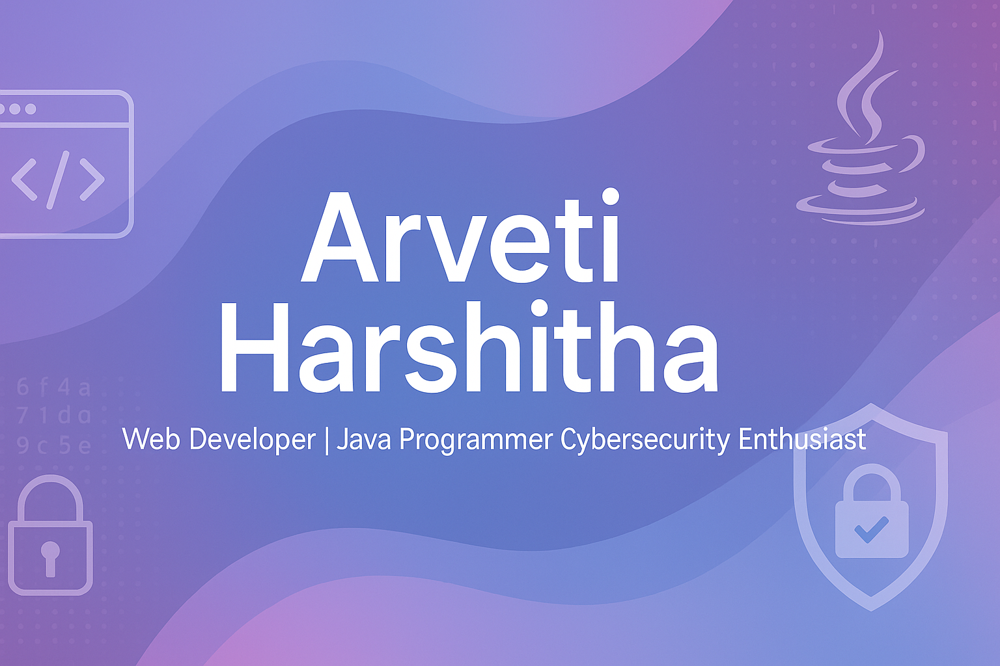

# 👋 Hi, I'm Arveti Harshitha

🎓 3rd-year B.Tech CSE (Cybersecurity) student at Jain University  
💻 Web Developer | Java Programmer | Cybersecurity Enthusiast  
🔐 Interested in network security, ethical hacking, and web development

---

## 🚀 Projects

| Project | Description | Tech Stack |
|--------|-------------|------------|
| 🛡️ Vulnerability Dashboard | Tracks OS-level vulnerabilities | Python, Streamlit |
| 🎮 Number Guessing Game | Simple Java game with scoring | Java |
| 📚 Student Grade Calculator | Calculates grades and summary | Java |
| 🛍️ Aroma Bliss Website | Perfume e-commerce website | HTML, CSS, JS |

---

## 🧠 Skills

```txt
Languages: Java, python, SQL, HTML, CSS, JavaScript 
Tools: Wireshark, Nmap, Streamlit, VS Code, IntelliJ  
Soft Skills: Communication, Teamwork, Problem Solving

